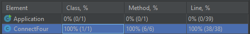

# Connect Four
This project is a game of Connect Four. 
Connect Four (also known as Four Up, Plot Four, Find Four, Captain's Mistress, Four in a Row, Drop Four, and Gravitrips in the Soviet Union) is a two-player connection board game, in which the players choose a color and then take turns dropping colored discs into a seven-column, six-row vertically suspended grid. The pieces fall straight down, occupying the lowest available space within the column. The objective of the game is to be the first to form a horizontal, vertical, or diagonal line of four of one's own discs. Connect Four is a solved game. The first player can always win by playing the right moves. 

## Table of contents
* [General info](#general-info)
* [Technologies](#technologies)
* [Setup](#setup)
* [Code coverage](#code-coverage)

## General info
The program will initially load empty Connect Four board. Player can choose the column number from 1-7 and enter the respective value.

* The vertical board is composed of seven columns and six rows. Initially, all positions are empty.
* Players introduce discs at the top of the columns. The disc falls to the bottom of the column if the column is empty. Future discs introduced to the same column will stack over previous ones.
* It is a two-person game. Player 1 uses red ('R') and Player 2 uses green ('G'). Players take alternate turns, inserting one disc each time.
* When no more discs can be inserted, the game finishes, and it is considered a draw.
* If a player inserts a disc and connects more than three discs of his color in a straight vertical, horizontal or diagonal line, then that player wins.
Docker file also created for docker build.
* If Player will provide invalid values apart from 1-7, he will be asked to reenter the valid values.
* If all positions are filled with the discs(42) moves and yet no one win then game will be over and no one wins.

## Technologies
Project is created with:
* Java 8
* Maven 

Below maven dependency used:
- Junit (used for unit and integration testing)
- System-Lambda (Used to read the output text of System.out.println for printGameBoard())
- Surefire to run the JUnit testcases.
## Setup
To run the project locally using maven
###Prerequisites
* Maven
* JDK 8

####Please follow below steps to run the project through maven locally:

1 Run below maven command from source directory to create jar file
```
$ mvn clean install
```
2 Run below command to locate the generated jar file.
```
$ cd target/
```
3 Run below java command to run the application from jar file
```
$ java -jar ConnectFour-1.0.jar
```
4 Application will start and display the empty ConnectFour board. And ask Player 1 to throw the red disc in column (1-7).
```
| | | | | | | |
| | | | | | | |
| | | | | | | |
| | | | | | | |
| | | | | | | |
| | | | | | | |

Player 1 [RED] - choose column (1-7): 
```
4 Please make sure your to enter valid column number (1-7) ,else it will ask again to enter the input.
```
Player 1 [RED] - choose column (1-7): r
Please enter valid input

Player 1 [RED] - choose column (1-7):
```

##Code coverage
We are following TDD approach for development, Below screenshot help to understand the test coverage of code.
  


Test Case result of Surefire report:
```
-------------------------------------------------------------------------------
Test set: com.game.ConnectFourTest
-------------------------------------------------------------------------------
Tests run: 11, Failures: 0, Errors: 0, Skipped: 0, Time elapsed: 0.183 s - in com.game.ConnectFourTest
```
Note: I wrote the Unit test cases for the ConnectFour class only.


Note: I wrote the Unit test cases for the ConnectFour class only.